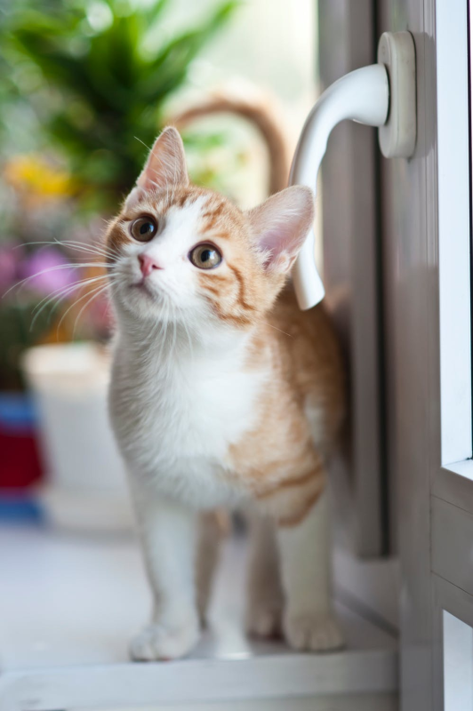
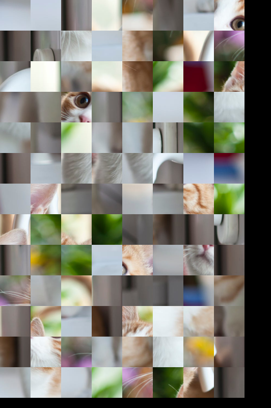

# Vaga Devops - SpaceTime Labs

Esse projeto contém uma mini aplicação desenvolvida em Python. Nós
esperamos que você complete ela fazendo algumas atividades de
desenvolvimento e infraestrutura.

## Estrutura da Aplicação

A aplicação consiste de uma API HTTP escrita em Flask, um
REDIS sendo usado como fila de tarefas e um "worker" responsável
por receber as tarefas, processa-lás e devolver o resultado.

```
.
├── http_api
│   ├── http_api
│   │   ├── config.py
│   │   ├── __init__.py
│   │   └── tasks.py
│   ├── Pipfile
│   ├── Pipfile.lock
│   └── wsgi.py
└── worker
    ├── Pipfile
    ├── Pipfile.lock
    └── worker
        ├── config.py
        ├── __main__.py
        └── tasks.py
```

Visão geral da aplicaçãozinha:

```
+------------+      +------------+                  +--------+
|  cliente   |<---->|  API HTTP  |<->[ redis ]<---->| worker |
|   HTTP     |      +------------+              \   +--------+
+------------+                                   \   +---------+
                                                  \->| worker  |
                                                     +---------+
```

A API têm três endpoints que estão documentados no arquivo `./http_api/openapi.yml`.

O worker é um mini-projeto Python que fica aguardando mensagens
em uma lista do Redis, as processa, e retorna o resultado (ou o erro).

## Exemplo de Funcionamento

Você pode iteragir com a API usando o cURL (ou com qualquer outro
programa que gostar).

Para enviar uma imagem para processamento:

Arquivo ./cat.png



Fonte: https://www.pexels.com/photo/orange-tabby-cat-near-window-2071873/

```shell
$ curl -H 'Content-Type: image/png' \
    --data-binary @./cat.png \
    http://localhost:5000/randomize
{"token":"b27f6016f9cf46a6baaddf09d2e5b221"}
```

Para consultar o status de um processamento:

```shell
$ curl http://localhost:5000/randomize/<token>/status
{"status":"requested"}
```

Para pegar o resultado de uma tarefa:

```shell
$ curl http://localhost:5000/randomize/<token>/result > ./out.png
```



## Mão na Massa!

Faça um _fork_ do projeto para seu GitHub antes de começar. Se tiver
qualquer tipo de dúvida sobre as atividades é só mandar uma mensagem pra
gente.

Sua _primeira missão_ é melhorar o ambiente de desenvolvimento! Adicione
Dockerfile's nos componentes API HTTP e _worker_ e um docker-compose.yml
para subir o REDIS e os componentes de forma coordenada, rodando
tudo dentro do Docker.

Nós presamos muito por uma pipeline de CI/CD funcionando. Sua _segunda
tarefa_ é criar um travis-ci.yaml que execute os testes da aplicação.

O desenvolvedor esqueceu de colocar algumas métricas importantes no
código. Altere a aplicação para registrar o tempo de execução da tarefa
no worker e o "lead-time" (tempo entre o pedido do usuário e o término do
processamento). Você pode registrar nos logs e mandar o output pra gente.

Alguns problemas são maiores que outros, e a arquitetura pode precisar
de algumas mudanças. Crie uma nova tarefa que receba um arquivo de texto
com número aleatoŕios e retorne a soma dos números pares existentes no arquivo.
A tarefa deve funcionar tanto para arquivos com 100MB quanto para arquivos
maiores, com 5GB de números.

Descreva como você implantaria essa solução (de preferência na AWS). Leve
em conta que vários clientes vão usar o sistema ao mesmo tempo e que,
idealmente, o processamento feito por um cliente não deve interferir (muito)
no tempo de processamento do outro cliente.

### Links Úteis

- [Docker Compose](https://docs.docker.com/compose/)
- [Travis CI](https://travis-ci.com/)
